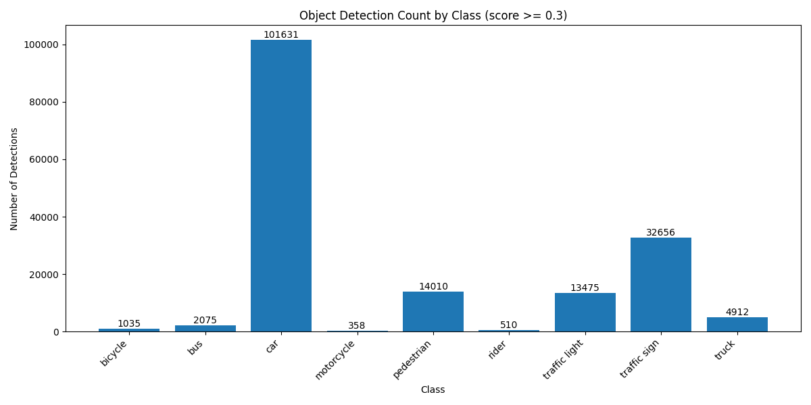
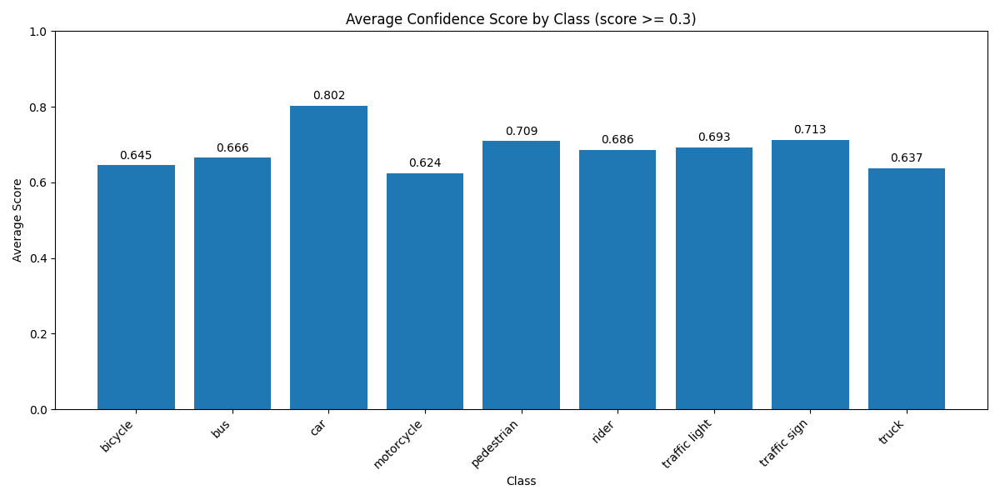
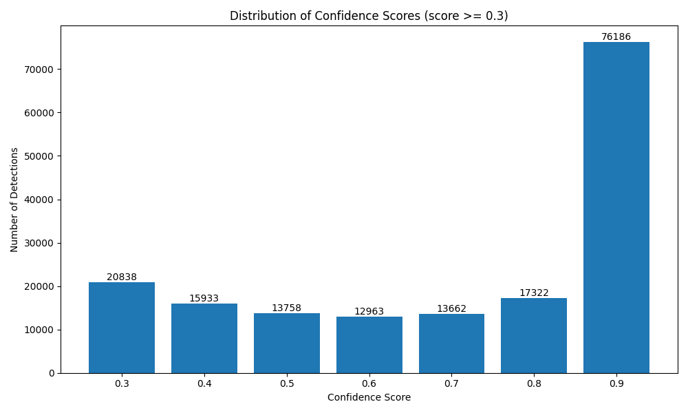
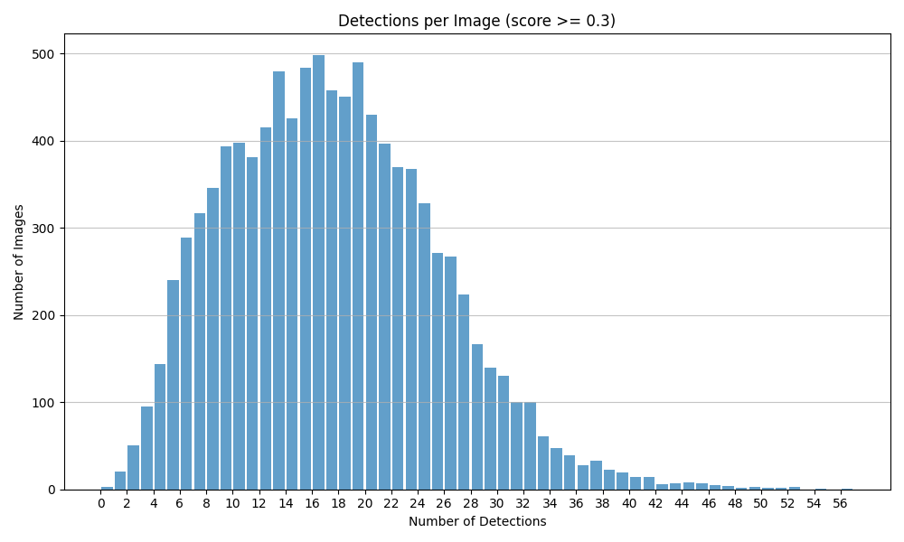

# Quantitative Performance Analysis of Faster R-CNN R50-FPN on BDD100K

This document provides a detailed quantitative analysis of the Faster R-CNN R50-FPN 1x model's performance on the complete BDD100K validation dataset (10,000 images). The analysis includes official evaluation metrics as well as detection statistics, class distribution, and confidence score patterns.

## 1. Evaluation Metrics

### 1.1 Official Evaluation Results

The model was evaluated on the BDD100K validation set using the standard detection metrics with an IoU threshold of 0.5:

| Metric | Value |
|--------|-------|
| Mean Average Precision (mAP) | **0.1916** |

### 1.2 Per-Category Performance 

| Category | Average Precision (AP) | Precision | Recall | GT Count | Pred Count |
|----------|------------------------|-----------|--------|----------|------------|
| car | 0.3868 | 0.4591 | 0.8424 | 102,506 | 188,083 |
| traffic sign | 0.2658 | 0.3565 | 0.7454 | 34,908 | 72,975 |
| traffic light | 0.2464 | 0.4893 | 0.5035 | 26,885 | 27,664 |
| truck | 0.1761 | 0.2205 | 0.7986 | 4,245 | 15,375 |
| bus | 0.1332 | 0.1724 | 0.7727 | 1,597 | 7,156 |
| rider | 0.1329 | 0.2114 | 0.6287 | 649 | 1,930 |
| pedestrian | 0.0000 | 0.0000 | 0.0000 | 0 | 36,266 |
| motorcycle | 0.0000 | 0.0000 | 0.0000 | 0 | 1,588 |
| bicycle | 0.0000 | 0.0000 | 0.0000 | 0 | 3,226 |
| train | 0.0000 | 0.0000 | 0.0000 | 15 | 0 |

The evaluation results reveal several key insights:

1. **Overall Performance**: The model achieves a moderate mAP of 0.1916, indicating room for improvement.

2. **Class Imbalance Impact**: The model performs best on the most common classes (car, traffic sign, traffic light), with AP values of 0.3868, 0.2658, and 0.2464 respectively.

3. **Precision vs. Recall Trade-off**: For most detected classes, the recall is significantly higher than precision, suggesting the model tends to generate more false positives than false negatives.

4. **Zero-AP Classes**: Four classes (pedestrian, motorcycle, bicycle, train) have AP values of 0, indicating either no ground truth samples available for evaluation or complete detection failure.

### 1.3 Overall Detection Statistics

| Metric | Value |
|--------|-------|
| Total ground truth boxes | 170,805 |
| Total prediction boxes | 354,263 |
| True positives | 130,943 |
| False positives | 223,320 |
| False negatives | 39,862 |
| Overall recall | 0.7666 |
| Overall precision | 0.3696 |

The high number of false positives (223,320) compared to true positives (130,943) confirms the model's tendency to over-predict, resulting in relatively low precision.

## 2. Detection Performance Overview

| Metric | Value |
|--------|-------|
| Number of Images Evaluated | 10,000 |
| Total Detections (score ≥ 0.3) | 170,662 |
| Average Detections per Image | 17.07 |
| Median Detections per Image | 17.00 |
| Maximum Detections per Image | 56 |

The model detects a substantial number of objects per image (average 17.07), indicating the complexity and richness of the BDD100K street scenes. The consistency between mean and median suggests a relatively balanced distribution of object counts across images.

## 3. Class Distribution

The model detected instances from all 10 target classes in the BDD100K dataset except for 'train' (not found in the quantitative analysis results). The distribution of detections across classes is as follows:

| Class | Count | Percentage | Average Confidence |
|-------|-------|------------|-------------------|
| car | 101,631 | 59.55% | 0.8024 |
| traffic sign | 32,656 | 19.13% | 0.7126 |
| pedestrian | 14,010 | 8.21% | 0.7093 |
| traffic light | 13,475 | 7.90% | 0.6926 |
| truck | 4,912 | 2.88% | 0.6375 |
| bus | 2,075 | 1.22% | 0.6656 |
| bicycle | 1,035 | 0.61% | 0.6451 |
| rider | 510 | 0.30% | 0.6863 |
| motorcycle | 358 | 0.21% | 0.6242 |
| train | 0 | 0.00% | N/A |

## 4. Confidence Score Analysis

The average confidence score across all detections is high, with most classes having an average confidence above 0.65. The highest average confidence is for the 'car' class (0.8024), while the lowest is for the 'motorcycle' class (0.6242).

The distribution of confidence scores shows that a significant portion of detections have very high confidence (0.9 and above), suggesting strong model certainty for many objects:

| Confidence Score | Number of Detections |
|------------------|----------------------|
| 0.9 - 1.0 | 76,186 (44.6%) |
| 0.8 - 0.9 | 17,322 (10.1%) |
| 0.7 - 0.8 | 13,662 (8.0%) |
| 0.6 - 0.7 | 12,963 (7.6%) |
| 0.5 - 0.6 | 13,758 (8.1%) |
| 0.4 - 0.5 | 15,933 (9.3%) |
| 0.3 - 0.4 | 20,838 (12.2%) |

## 5. Detection Density Distribution

The number of detections per image varies considerably across the dataset, reflecting the diversity of scenes from sparse rural areas to dense urban environments:

## 6. Relationship to Class Imbalance

The detection distribution closely mirrors the class imbalance typically observed in autonomous driving datasets:

1. **Dominant Classes**: 'Car' is by far the most frequently detected class (59.55% of detections), which aligns with its prevalence in real-world driving scenarios.

2. **Medium-Frequency Classes**: 'Traffic sign', 'pedestrian', and 'traffic light' form the next tier of detection frequency (combined 35.24%), representing critical elements for safe navigation.

3. **Low-Frequency Classes**: 'Truck', 'bus', 'bicycle', 'rider', and 'motorcycle' have proportionally fewer detections (combined 5.22%), reflecting their relative rarity in diverse driving scenarios.

4. **Rare Classes**: The 'train' class has zero detections across the entire validation set, indicating its extreme rarity in the dataset or potential difficulties in detection.

## 7. Analysis of Confidence Patterns

Several interesting patterns emerge when analyzing confidence scores:

1. **Class Complexity Correlation**: There appears to be a correlation between object complexity and confidence scores. Simpler, larger objects like 'car' (0.8024) have higher average confidence than smaller or more varied objects like 'motorcycle' (0.6242).

2. **Frequency-Confidence Relationship**: More frequently occurring classes tend to have higher confidence scores, suggesting the model has learned more robust representations for common objects.

3. **Bimodal Distribution**: The overall confidence distribution shows a bimodal pattern, with peaks at very high confidence (0.9+) and at the lower threshold (0.3-0.4). This suggests the model is either very certain or relatively uncertain about its detections, with fewer predictions in the middle confidence ranges.

## 8. Implications for Model Performance

Based on the quantitative analysis, we can draw several conclusions about the model's performance:

1. **Strong Performance on Common Objects**: The model demonstrates robust detection capabilities for common objects in driving scenes, particularly cars and traffic infrastructure elements.

2. **Class Imbalance Effects**: The severe class imbalance in the dataset appears to impact detection performance, with rare classes having fewer detections and generally lower confidence scores.

3. **Confidence Calibration**: The high percentage of very high confidence detections (44.6% with confidence ≥ 0.9) suggests the model may be well-calibrated for common objects but potentially overconfident in some predictions.

4. **Scale Variations**: The variance in detection counts per image (from few to 56 detections) indicates the model can handle scenes of varying complexity and object density.

## 9. Limitations of the Analysis

It's important to acknowledge the limitations of this analysis:

1. **No Ground Truth Comparison**: Without comparison to ground truth annotations, we cannot compute precision, recall, mAP, or analyze false positives/negatives. This limits our ability to fully evaluate detection accuracy.

2. **Confidence Threshold Dependency**: All metrics are computed using a confidence threshold of 0.3. Different thresholds would yield different results and potentially different interpretations.

3. **Missing Spatial Analysis**: This analysis does not include spatial distribution of detections or size-based performance variations, which could provide additional insights.

## 10. Summary and Next Steps

The Faster R-CNN R50-FPN 1x model shows strong detection performance on the BDD100K dataset, with particularly good results for common object classes. The model detected 170,662 objects across 10,000 validation images, with consistent detection counts across images.

For a more comprehensive evaluation, the following additional analyses would be valuable:

1. **Per-category Precision/Recall Analysis**: Compute precision, recall, and AP for each class using the ground truth annotations.

2. **Error Analysis**: Analyze false positives and false negatives to identify common failure modes.

3. **Environmental Condition Analysis**: Evaluate performance across different environmental conditions (weather, time of day, scene type) to identify potential biases.

4. **Object Size Analysis**: Examine detection performance by object size to understand the model's limitations for small, medium, and large objects. 